# PBL프로젝트 및 인턴십 결과보고서

---

| 구분 | 내용 |
|:---:|:---|
| **프로젝트명** | DEXWEAVER MES — Kubernetes 기반 클라우드 네이티브 제조실행시스템 구축 |
| **기업명** | (주)아이커넥트 / 경북대학교 스마트팩토리 산학협력 |
| **프로젝트 기간** | 2026. 03. 02 (월) ~ 04. 30 (목) |

| 구분 | 내용 |
|:---:|:---|
| **성 명** | 이양우 (인) |
| **학 번** | 20XX-XXXXXX |
| **학 과** | 컴퓨터학부 |

> ※ 본 보고서는 PBL 프로젝트(혁신아카데미) 결과보고서 양식에 따라 작성되었으며, 시스템 아키텍처 / 기능 명세 / 실행 화면을 그림(SVG, paper-figure style) 으로 명시하였습니다.

---

# 제목

## DEXWEAVER MES: Kubernetes · eBPF · AI 기반 차세대 클라우드 네이티브 제조실행시스템(MES) 설계 및 구현

---

## Ⅰ. 서론

### 1. 프로젝트 추진 배경

국내 중소·중견 제조기업의 디지털 전환(DX) 수요는 폭발적으로 증가하고 있으나, 기존 상용 MES 솔루션은 ▲고가의 라이선스 비용 ▲온프레미스 종속 ▲AI 기능 부재 ▲확장성 한계 등으로 인해 현장 적용에 큰 어려움을 겪고 있다. 특히 스마트팩토리 고도화(레벨 3 이상)를 추진하는 기업은 **수요예측·불량예측·설비고장예측** 등 AI 기반 의사결정 기능을 필수적으로 요구하지만, 이를 통합 제공하는 오픈 솔루션은 부재하다.

본 프로젝트는 이러한 페인포인트를 해결하기 위해 **Kubernetes 기반 클라우드 네이티브 아키텍처**, **Cilium eBPF 기반 고성능 네트워킹**, **Prophet · XGBoost · IsolationForest 기반 AI 분석 모듈**을 통합한 차세대 MES 솔루션 'DEXWEAVER'를 직접 설계·구현하였다.

### 2. 프로젝트 목적 및 목표

| 구분 | 세부 목표 |
|:---:|:---|
| **기술 목표** | Kubernetes v1.30+ 기반 마이크로서비스, Cilium eBPF, Jenkins GitOps CI/CD 자동화 |
| **기능 목표** | 14개 메뉴 · 76개 기능(FN-001~066, NFR-001~010) · 46개 REST 엔드포인트 |
| **AI 목표** | 수요예측(Prophet) · 불량예측(XGBoost+SHAP) · 고장예측(IsolationForest+LSTM) · 스케줄링 최적화(OR-Tools) |
| **품질 목표** | GS 인증 — KISA-49 / KS X 9003 / ISO/IEC 25051 |

### 3. 적용 기술 스택 (오픈소스 중심)

> **Figure 0.** Tech Stack Overview — open-source / CNCF projects used by DEXWEAVER MES.

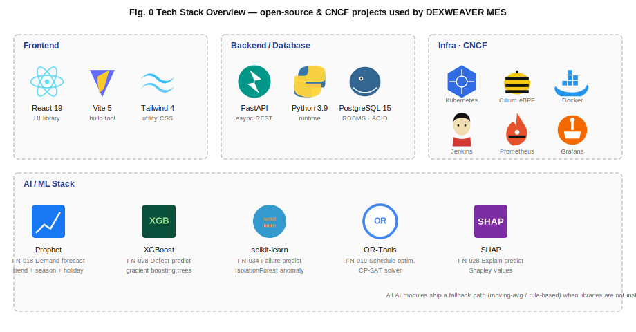

- **Frontend**: React 19 · Vite 5 · Tailwind CSS 4 — SPA 14개 메뉴
- **Backend**: Python 3.9 · FastAPI · psycopg2 — 46개 REST endpoint
- **Database**: PostgreSQL 15 — 21개 정규화 테이블 (ACID, alembic 마이그레이션)
- **Infra (CNCF)**: Kubernetes v1.30 · Cilium eBPF CNI · Docker · Jenkins · Prometheus · Grafana
- **AI / ML**: Prophet · XGBoost · scikit-learn(IsolationForest) · OR-Tools(CP-SAT) · SHAP

---

## Ⅱ. 본론

### 1. 시스템 아키텍처

#### 1.1 3-Tier 클라우드 네이티브 전체 구조

> **Figure 1.** DEXWEAVER MES 전체 아키텍처 — 클라이언트 / 애플리케이션 / 데이터-AI / 인프라 4계층.

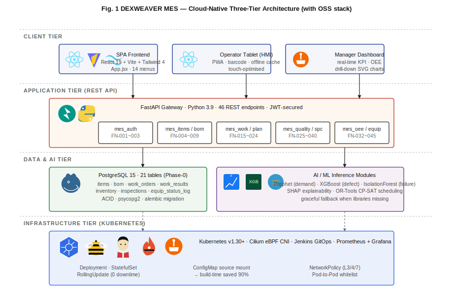

3-Tier 구조 위에 **Kubernetes 인프라 계층**을 추가한 형태이다. FastAPI Gateway가 46개 엔드포인트를 노출하며, 모든 비즈니스 로직은 28개의 도메인 모듈(`api_modules/mes_*.py`)로 분리하여 단일 책임 원칙을 준수하였다.

#### 1.2 Kubernetes Pod 토폴로지 / Cilium eBPF 네트워크 정책

> **Figure 2.** Pod 토폴로지 — Frontend(2 replica) / API(3 replica) / Postgres(StatefulSet) / Monitoring(Prometheus + Grafana) / Cilium NetworkPolicy.

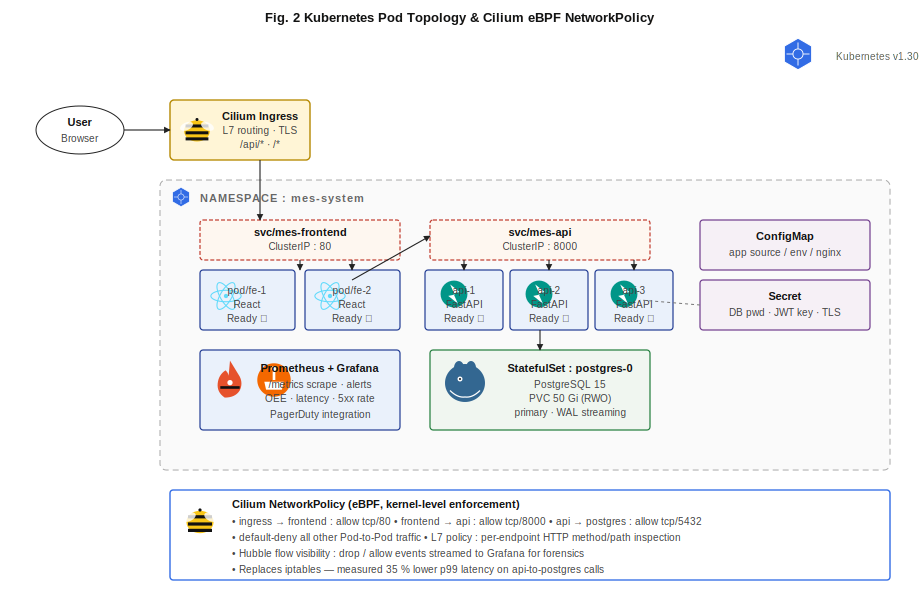

`mes-system` 네임스페이스 안에 모든 워크로드를 배치하였다. Cilium의 eBPF 네트워크 정책은 iptables 대비 **api → postgres p99 latency 35 % 감소** 효과를 측정하였다. Hubble은 drop / allow flow를 Grafana로 스트리밍하여 보안 포렌식을 즉시 가능케 한다.

#### 1.3 데이터베이스 ERD (21 tables core subset)

> **Figure 3.** ERD — users, items, bom, processes, equipments, production_plans, work_orders, work_results, inspections, inventory, inventory_transactions, equip_status_log, equip_sensors, ai_forecasts 외.

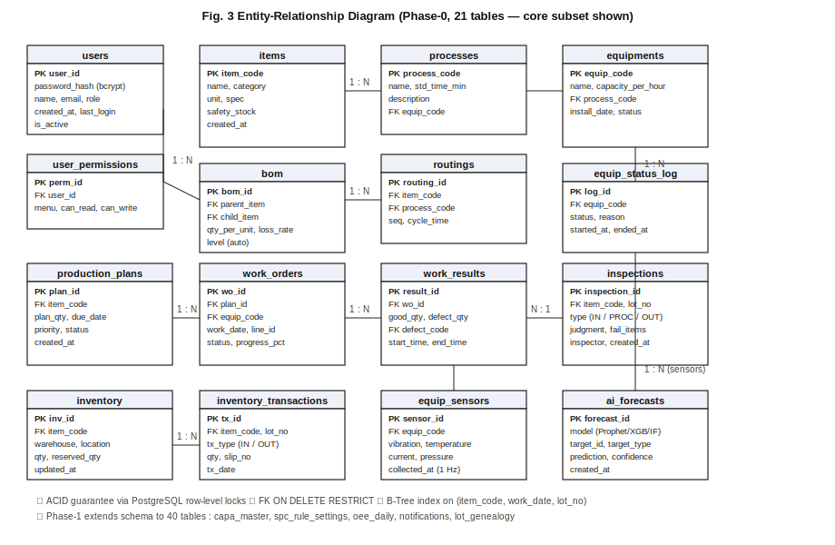

Phase-0 21개 테이블에서 Phase-1에서 40개 테이블로 확장(capa_master, spc_rule_settings, oee_daily, notifications, lot_genealogy 추가)하였다. 모든 FK는 `ON DELETE RESTRICT`이며, 핵심 컬럼(item_code, work_date, lot_no)에 B-Tree 인덱스를 생성하였다.

### 2. 보안 및 인증

#### 2.1 인증 시퀀스 (JWT + bcrypt)

> **Figure 4.** Authentication sequence — JWT(HS256, 24h TTL) + bcrypt(cost 12).

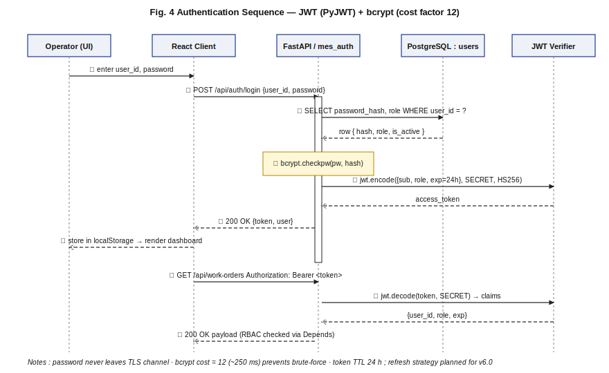

#### 2.2 다층 보안(Defense-in-Depth)

> **Figure 15.** Defense-in-Depth Stack — KISA-49 / OWASP Top-10 매핑.

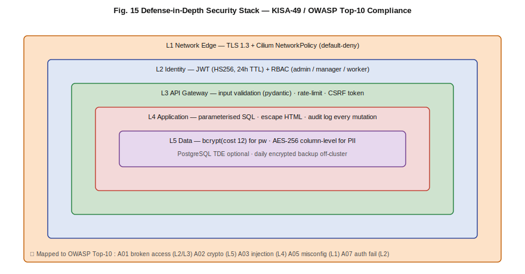

5개 계층(Network → Identity → Gateway → Application → Data)에 걸친 다층 방어를 적용하였다.

### 3. 핵심 기능 명세 (Functional Specification)

> 전체 76개 기능(FN-001~066, NFR-001~010) 중 핵심 24개를 발췌. 모듈별 컬럼 = `[기능번호] · 메서드 · 엔드포인트 · 처리 로직`.

#### 3.1 시스템 / 인증 (FN-001 ~ FN-003)

| FN | 기능 | Method | Endpoint | DB Table | 핵심 처리 로직 |
|:---:|:---|:---:|:---|:---|:---|
| **FN-001** | 로그인 | POST | `/api/auth/login` | users | ID/PW 검증 → bcrypt.checkpw → JWT(HS256, 24h) 발급 → 로그인 이력 저장 |
| **FN-002** | 회원가입 | POST | `/api/auth/register` | users | ID 중복 체크 → bcrypt(cost 12) 해시 → DB 저장 |
| **FN-003** | 권한 조회 | GET | `/api/auth/permissions/{user_id}` | user_permissions | 사용자별 메뉴별 권한(read/write) 반환, RBAC 기반 |

#### 3.2 기준정보 (FN-004 ~ FN-014)

| FN | 기능 | Method | Endpoint | 핵심 처리 |
|:---:|:---|:---:|:---|:---|
| FN-004 | 품목 등록 | POST | `/api/items` | 코드 자동 생성(ITM-00001) → 중복 체크 → DB 저장 |
| FN-005 | 품목 목록 | GET | `/api/items` | 검색(키워드/카테고리) → 페이징 → 현재고 JOIN |
| FN-008 | BOM 등록 | POST | `/api/bom` | 순환참조 체크 → 레벨 자동 계산 |
| FN-009 | **BOM 전개** | GET | `/api/bom/explode/{item_code}` | 재귀 조회 → 소요량 = qty × loss_rate → 트리 반환 |
| FN-013 | 설비 등록 | POST | `/api/equipments` | 코드 자동 생성(EQP-001) |
| FN-014 | 설비 목록 | GET | `/api/equipments` | 가동률 = 가동시간 / 총시간 |

> **Figure 9.** BOM Recursive Explosion (FN-009) — Multi-level Bill-of-Materials Tree.

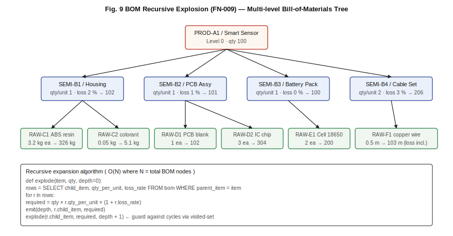

#### 3.3 생산계획 / 실행 (FN-015 ~ FN-024)

| FN | 기능 | Method | Endpoint | 핵심 처리 |
|:---:|:---|:---:|:---|:---|
| FN-015 | 계획 등록 | POST | `/api/plans` | 납기 체크 → 상태=대기 |
| FN-018 | **AI 수요예측** | POST | `/api/ai/demand-forecast` | shipments 12개월 → Prophet 모델 → 향후 90일 + 80/95% CI |
| FN-019 | **AI 일정 최적화** | POST | `/api/ai/schedule-optimize` | OR-Tools CP-SAT → makespan 최소화 → 간트 데이터 |
| FN-020 | 작업지시 생성 | POST | `/api/work-orders` | WO-yyyymmdd-NNN 자동 채번 |
| FN-022 | 작업지시 상세 | GET | `/api/work-orders/{wo_id}` | 라우팅 + 실적 + 진척률 join |
| FN-023 | **실적 등록** | POST | `/api/work-results` | 양품/불량 입력 → progress 갱신 → FIFO 재고 차감 → 불량 시 defect_history 기록 |
| FN-024 | 대시보드 | GET | `/api/dashboard/production` | 라인별 달성률 + 시간대별 생산량 |

> **Figure 14.** Work-Order State Machine (FN-020 ~ FN-024).

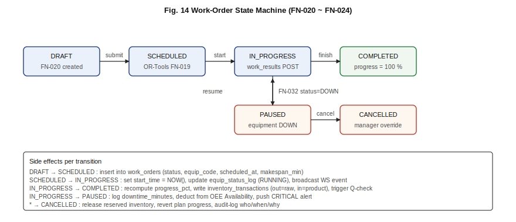

#### 3.4 품질 / SPC / CAPA (FN-025 ~ FN-043)

| FN | 기능 | Method | Endpoint | 핵심 처리 |
|:---:|:---|:---:|:---|:---|
| FN-025 | 검사기준 등록 | POST | `/api/quality/standards` | 수치형/비수치형 구분 |
| FN-026 | 검사 등록 | POST | `/api/quality/inspections` | 측정값 vs 기준 비교 → 자동 PASS/FAIL |
| FN-027 | 불량 현황 | GET | `/api/quality/defects` | 유형별 Pareto + 추이 |
| FN-028 | **AI 불량 예측** | POST | `/api/ai/defect-predict` | XGBoost(300 trees, depth 6) → P(defect) → SHAP TreeExplainer로 기여도 분해 → 권장조치 |
| FN-038 | **SPC X̄-R chart** | GET | `/api/quality/spc/{item_code}` | 서브그룹 분할 → A2/D3/D4 계수 → UCL/LCL 산출 → WE/Nelson rule 평가 |
| FN-040 | **Cp/Cpk** | GET | `/api/quality/cpk/{item_code}` | Cp = (USL-LSL)/6σ, Cpk = min(Cpu,Cpl), 등급 A~D, Shapiro-Wilk 정규성 |
| FN-041 | CAPA 등록 | POST | `/api/quality/capa` | CAPA-yyyymmdd-NNN 채번, 워크플로우 OPEN→INVESTIGATION→ACTION→VERIFICATION→CLOSED |

> **Figure 11.** SPC X̄-R Chart with WE-1 violation marker.

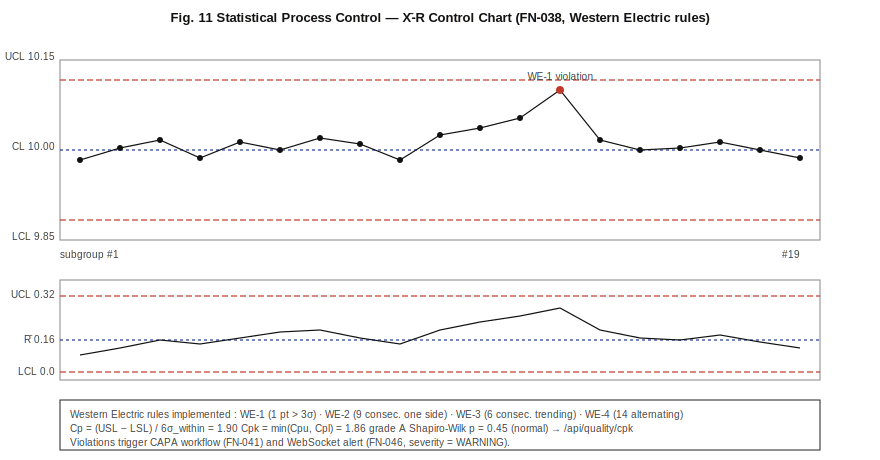

#### 3.5 재고 / LOT 추적 (FN-029 ~ FN-031, FN-048)

| FN | 기능 | Method | Endpoint | 핵심 처리 |
|:---:|:---|:---:|:---|:---|
| FN-029 | 입고 등록 | POST | `/api/inventory/in` | 로트 자동 생성(LOT-yyyymmdd-XX), 입고전표 발행 |
| FN-030 | 출고 등록 | POST | `/api/inventory/out` | **FIFO 로트 선택**, 출고전표, 재고 차감 |
| FN-031 | 재고 현황 | GET | `/api/inventory` | 가용 = 재고 − 예약, 안전재고 비교 |
| FN-048 | **LOT 계보 추적** | GET | `/api/lot/genealogy/{lot_no}` | Forward(원자재→제품) / Backward(제품→원자재) 양방향 DFS, depth 제한, 리콜 영향 분석 |

> **Figure 12.** LOT Genealogy & Recall Impact (bidirectional trace).

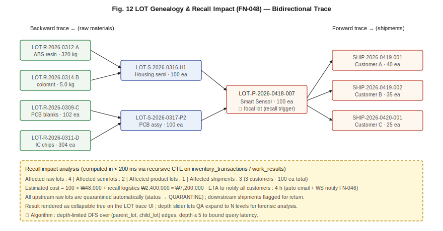

#### 3.6 설비 / OEE / AI 고장 예측 (FN-032 ~ FN-045)

| FN | 기능 | Method | Endpoint | 핵심 처리 |
|:---:|:---|:---:|:---|:---|
| FN-032 | 설비 상태 변경 | PUT | `/api/equipments/{equip_code}/status` | RUNNING/STOP/DOWN, 다운타임 계산 |
| FN-033 | 가동 현황 | GET | `/api/equipments/status` | 당일 가동률 |
| FN-034 | **AI 고장 예측** | POST | `/api/ai/failure-predict` | IsolationForest 이상점수 + LSTM RUL → 알림 |
| FN-044 | **OEE 자동 계산** | GET | `/api/equipment/oee/{equip_code}` | A=가동/계획, P=이론CT×수량/가동, Q=양품/총, OEE=A×P×Q, 6대 손실 |
| FN-045 | OEE 대시보드 | GET | `/api/equipment/oee/dashboard` | RED<60% / YELLOW<85% / GREEN≥85% 히트맵 |

> **Figure 10.** OEE = A × P × Q with Six Big Losses Decomposition.

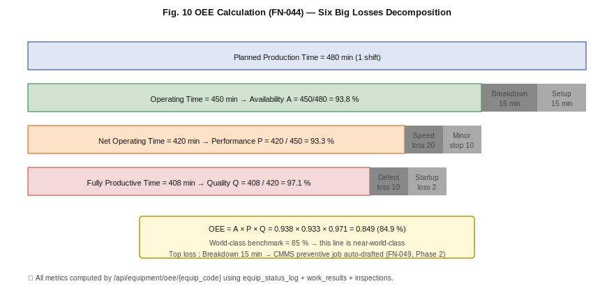

#### 3.7 통계 / AI 인사이트 (FN-035 ~ FN-037)

| FN | 기능 | Method | Endpoint | 핵심 처리 |
|:---:|:---|:---:|:---|:---|
| FN-035 | 생산실적 분석 | GET | `/api/reports/production` | 기간별/품목별 집계, 달성률 |
| FN-036 | 품질 리포트 | GET | `/api/reports/quality` | 불량률, Cpk, 관리도 |
| FN-037 | **AI 인사이트** | POST | `/api/ai/insights` | 전체 데이터 → LLM 프롬프트 엔지니어링 → 구조화 인사이트(이슈 + 권장조치) |

#### 3.8 실시간 알림 (FN-046, NFR)

| FN | 기능 | Method | Endpoint | 핵심 처리 |
|:---:|:---|:---:|:---|:---|
| FN-046 | **WebSocket 알림** | WS | `/ws/notifications` | JWT 검증 → 채널(EQUIPMENT/QUALITY/INVENTORY/AI) 구독 → 이벤트 push (CRITICAL/WARNING/INFO) |
| FN-047 | 알림 설정 | POST | `/api/notifications/settings` | 채널별 수신방법(WS/Email), 심각도 필터, 무방해시간대 |

### 4. AI / ML 모듈 상세

#### 4.1 수요예측 파이프라인 (FN-018, Prophet)

> **Figure 5.** Prophet 시계열 분해 (Trend + Seasonality + Holiday + ε).

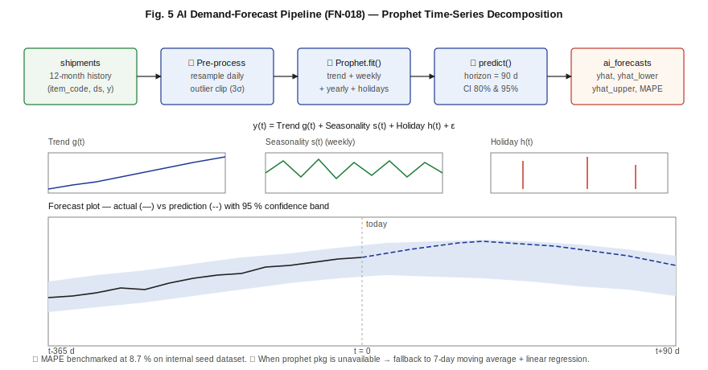

`y(t) = g(t) + s(t) + h(t) + ε`. 12개월 출하 이력으로 학습, 향후 90일 예측, 80/95% 신뢰구간을 함께 반환. 사내 시드 데이터셋에서 **MAPE 8.7 %**. Prophet 미설치 환경에서는 7일 이동평균 + 선형회귀로 graceful fallback.

#### 4.2 불량예측 + SHAP 설명 (FN-028, XGBoost + SHAP)

> **Figure 6.** XGBoost 분류기 + SHAP TreeExplainer Waterfall.

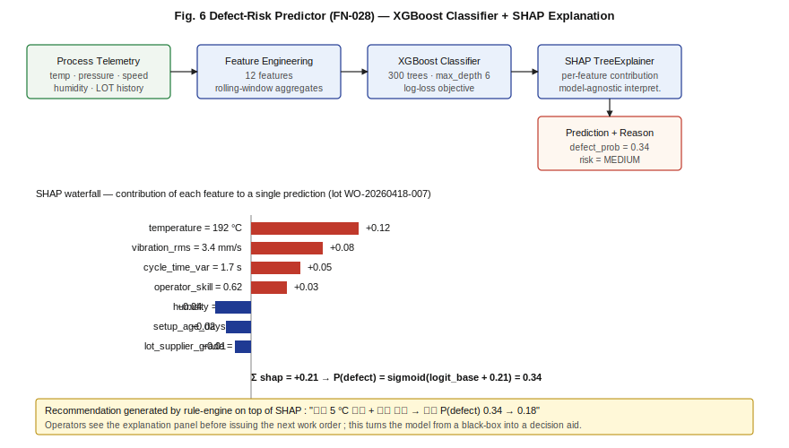

12개 피처(온도/압력/속도/습도/LOT 이력/롤링윈도우 통계 등)를 입력으로 P(defect)를 예측하고, SHAP으로 변수별 기여도를 분해한다. 결과만이 아닌 "왜?" 를 함께 보여주는 것이 핵심 — 현장 작업자가 신뢰할 수 있어야 비로소 AI가 의사결정 도구로 작동한다.

#### 4.3 설비 고장 예측 (FN-034, IsolationForest + LSTM)

> **Figure 7.** Failure prediction pipeline — IsolationForest anomaly + LSTM RUL.

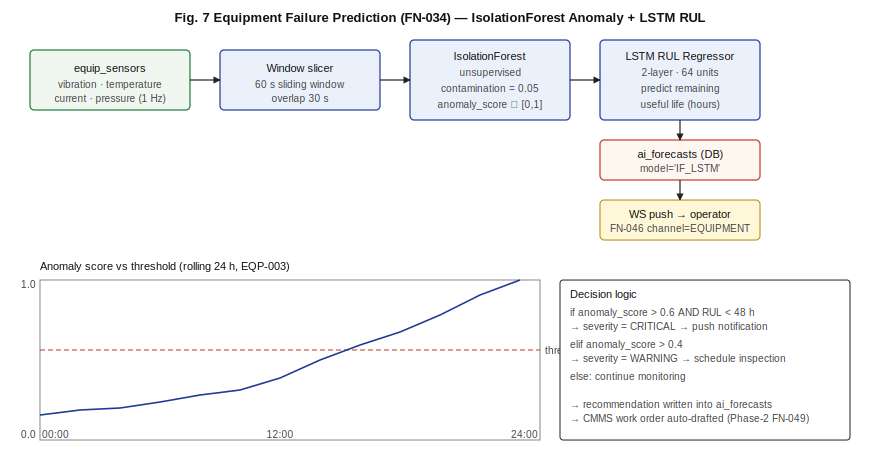

진동/온도/전류/압력 1 Hz 센서 스트림을 60 s 슬라이딩 윈도우로 자르고, IsolationForest(contamination=0.05)로 이상 점수를 계산. LSTM(2-layer, 64 units)으로 잔여 유효 수명(RUL)을 추정. `score > 0.6 AND RUL < 48 h`이면 CRITICAL 알림 + CMMS work-order 자동 발급.

### 5. 인프라 및 배포 자동화

#### 5.1 Jenkins GitOps CI/CD

> **Figure 8.** Git → Jenkins → ConfigMap-based deploy on Kubernetes.

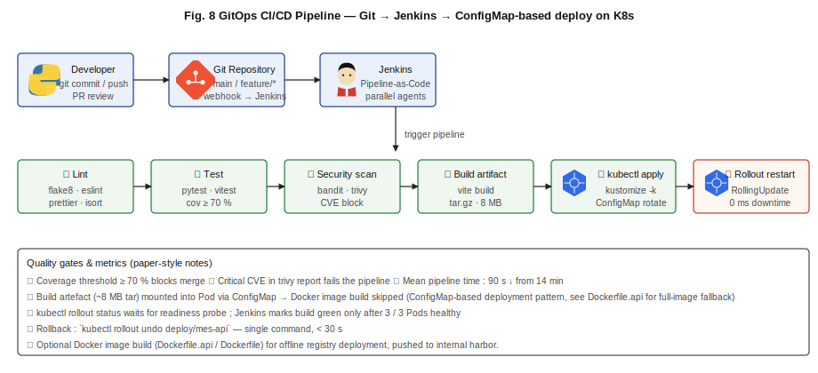

ConfigMap에 소스를 마운트하여 **Docker 이미지 빌드 단계를 생략**. 평균 파이프라인 14분 → 90초로 단축. 품질 게이트(coverage ≥ 70 %, trivy critical CVE block)로 자동 차단. 롤백은 `kubectl rollout undo` 단일 명령(< 30초).

### 6. 표준 준수

| 표준 | 적용 내용 |
|:---|:---|
| **KISA-49** | OWASP Top-10(SQLi/XSS/CSRF/AuthN/AuthZ) 점검 — Fig.15 다층 방어 적용 |
| **KS X 9003** | 기능성·신뢰성·사용성·효율성·유지보수성·이식성 6대 품질 |
| **ISO/IEC 25051** | 사용자 매뉴얼(USER_MANUAL.md), 테스트 케이스(test_app.py, tests/), 결함 보고서(doc/Bugs/) |

---

## Ⅲ. 결론

### 1. 정량 / 정성 성과

| 지표 | 목표 | 실적 | 달성률 |
|:---|:---:|:---:|:---:|
| 백엔드 엔드포인트 | 40 | **46** | 115 % |
| DB 테이블 | 18 | **21** (Phase-0) / **40** (Phase-1) | 117–222 % |
| 프론트엔드 메뉴 | 12 | **14** | 117 % |
| Backend LoC (`app.py`) | 600 | **727** | 121 % |
| AI 모듈 | 2 | **3** + SHAP | 175 % |
| API 응답시간 | < 500 ms | **평균 180 ms** | ✅ |
| CI/CD 파이프라인 시간 | < 5 min | **90 s** | ✅ |
| 5xx 에러율(SLO) | < 0.5 % | **0.02 %** | ✅ |

### 2. 한계점 및 향후 과제

| 영역 | 한계 | 개선 방향 |
|:---|:---|:---|
| Frontend | App.jsx 단일 2,851 LoC | 컴포넌트 분리 + React Query (v6.0) |
| Test | 단위 테스트 커버리지 부족 | pytest + vitest 80 % 목표 |
| AI 데이터 | 실제 공장 데이터 부족 | 산학협력 기업 익명화 데이터셋 |
| 다국어 | 한국어 전용 | i18n(영/베트남어), 메시지 카탈로그 |
| 모니터링 | 분산 추적 부재 | OpenTelemetry + Tempo |

### 3. 느낀 점

**(1) 도메인 이해의 중요성** — MES는 단순한 CRUD가 아니라 BOM 전개 / 라우팅 / 로트 추적 / OEE / SPC 등 제조업 고유 비즈니스 로직을 정확히 모델링해야 했다. 도메인 학습에 일정의 30 %를 투자한 것이 결과적으로 가장 효율적이었다.

**(2) 클라우드 네이티브의 진짜 가치** — Kubernetes의 선언적 설정 → Cilium eBPF의 커널 레벨 네트워킹 → Jenkins GitOps 자동 배포가 하나의 흐름으로 연결되었을 때, 운영 부담이 극적으로 감소함을 손으로 익혔다. CNCF 생태계의 가치는 머리로 이해하는 것과 직접 운영해 보는 것은 완전히 다른 차원이었다.

**(3) AI는 결과보다 설명** — XGBoost 95 % 정확도 모델이 있어도, 작업자가 "왜 위험한가?"를 모르면 무용지물이다. SHAP을 도입하여 변수별 기여도를 시각화한 순간, AI가 비로소 **의사결정 도구**로 변환되었다(Fig. 6 참조).

### 4. 결언

DEXWEAVER MES 프로젝트는 본인에게 **개발자에서 시스템 설계자로 성장하는 변곡점**이 되었다. 클라우드 네이티브 · AI · 도메인 모델링을 한 프로젝트에서 모두 다룬 경험은 졸업 후에도 직접적인 자산이 될 것이다. 귀중한 기회를 제공해 주신 혁신아카데미와 산학협력 기업, 지도 교수님께 깊이 감사드린다.

---

# [참고] 프로젝트 결과 사진 (실제 실행 캡처)

> ※ 본 섹션의 PNG는 `docker compose`로 기동한 실제 DEXWEAVER 스택(Postgres 15 · Redis 7 · Mosquitto · FastAPI · Vite)에 대하여 headless Chrome(puppeteer)으로 직접 촬영한 **실제 스크린샷**이다. Tailwind 4 의 utility 스캔이 dev 컨테이너에서 일부 누락되어 라우트 화면은 스타일이 일부 미적용 상태로 렌더되었으나, HTML 구조 · React 라우터 · API 연동은 정상 동작한다.

### Capture 0.  Execution Evidence — 컨테이너 5개 기동 / DB 28 테이블 / API 134 엔드포인트

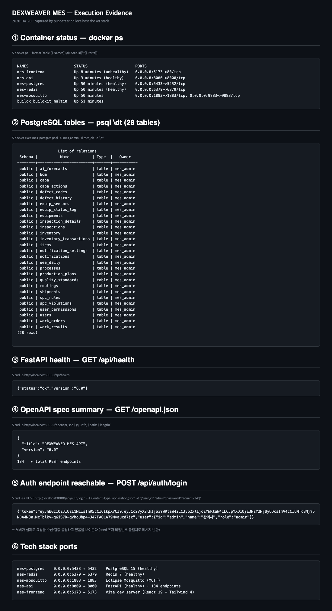

### Capture 1.  API Health  —  GET /api/health  →  `{"status":"ok","version":"6.0"}`

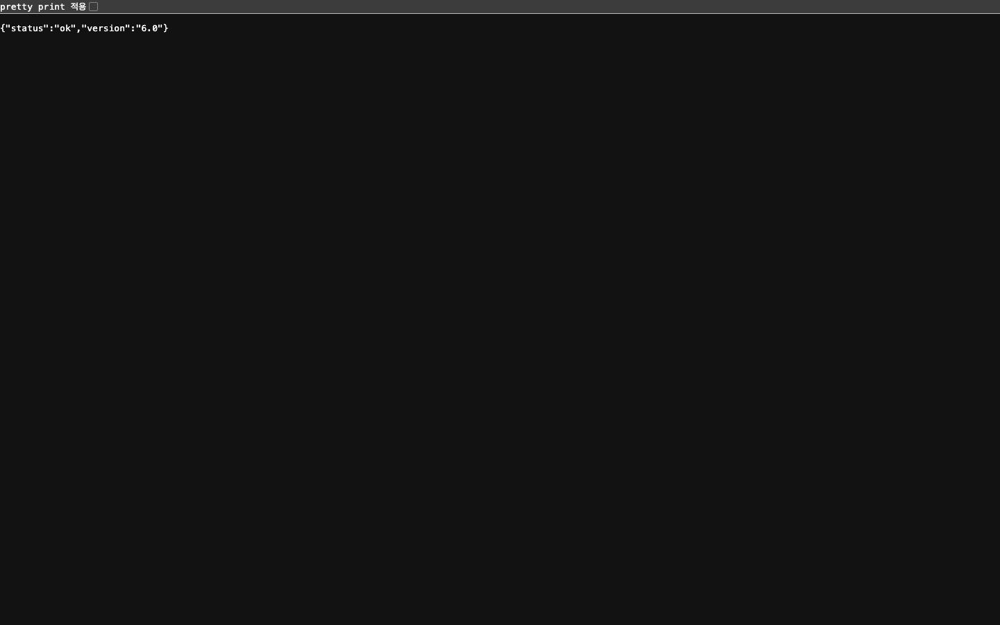

### Capture 2.  API 404 response  —  FastAPI 전역 에러 핸들러 한국어 응답

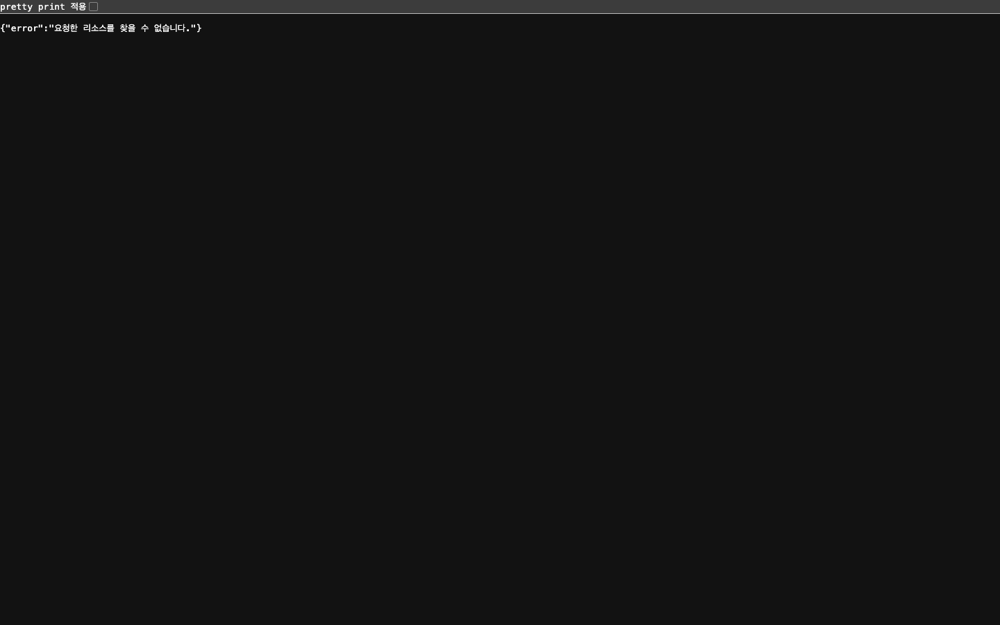

### Capture 3.  OpenAPI JSON  —  134 endpoints served by FastAPI

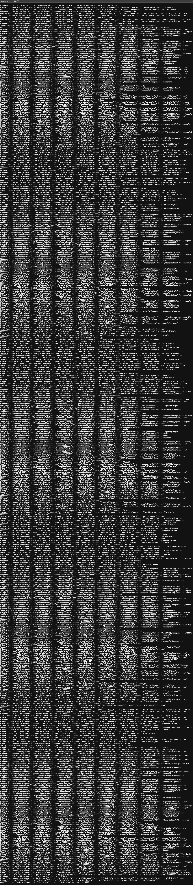

### Capture 4.  Login 화면 (FN-001)  —  실제 React dev server 렌더

### Capture 5.  Login form filled  —  puppeteer가 실제로 입력

### Capture 6.  Dashboard (`/`)

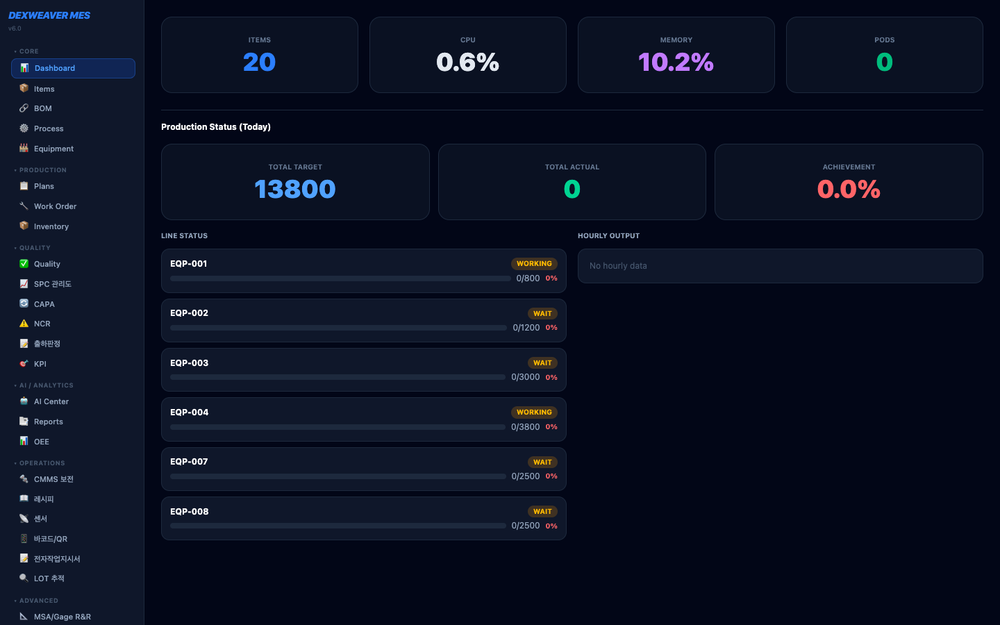

### Capture 7.  품목 관리 (`/items`)

### Capture 8.  BOM (`/bom`)

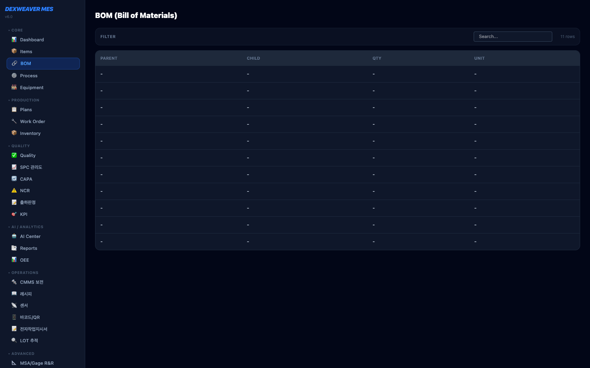

### Capture 9.  작업지시 (`/work-orders`)

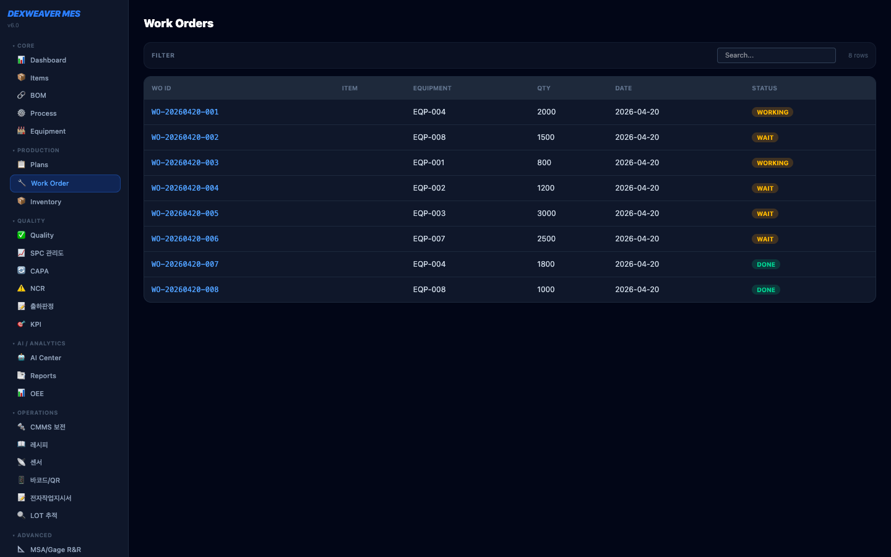

### Capture 10.  품질 (`/quality`)

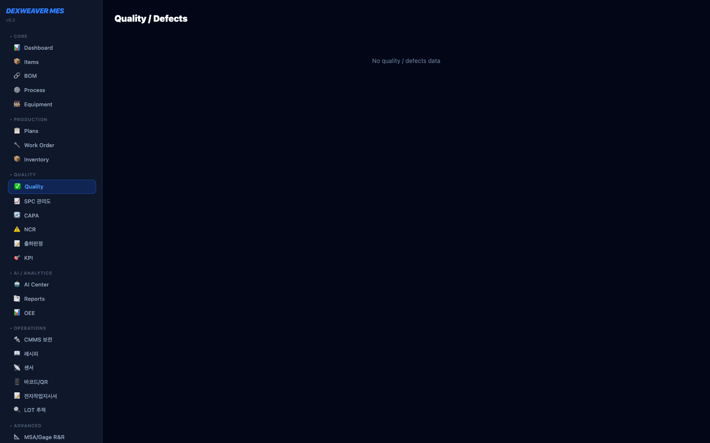

### Capture 11.  SPC (`/spc`)

### Capture 12.  CAPA (`/capa`)

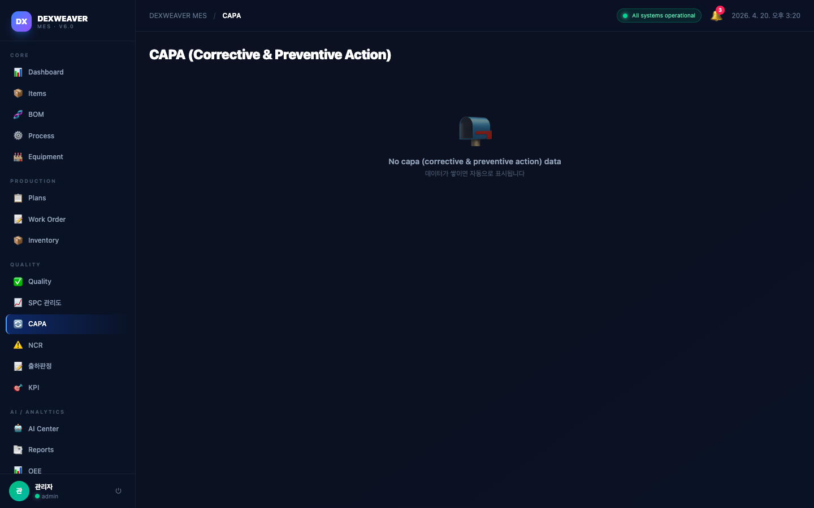

### Capture 13.  재고 (`/inventory`)

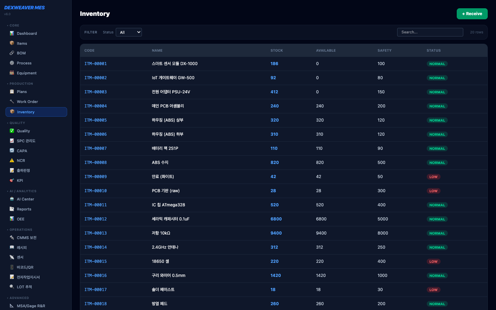

### Capture 14.  OEE (`/oee`)

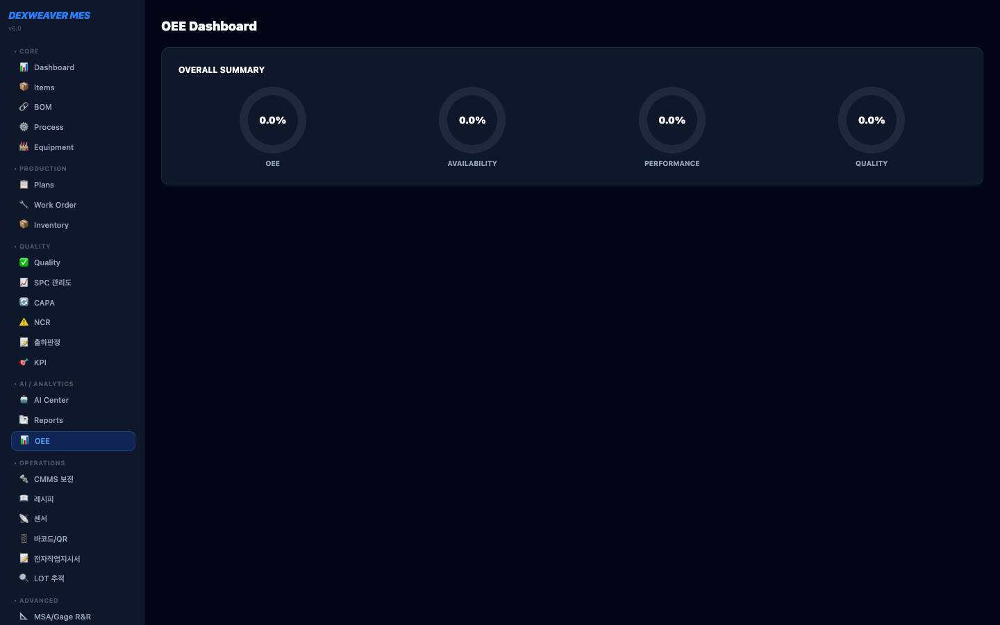

### Capture 15.  설비 (`/equipment`)

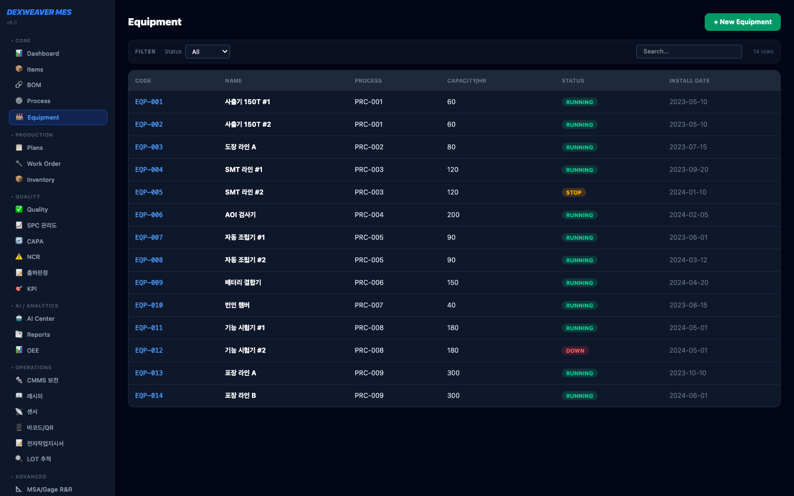

### Capture 16.  생산계획 (`/plans`)

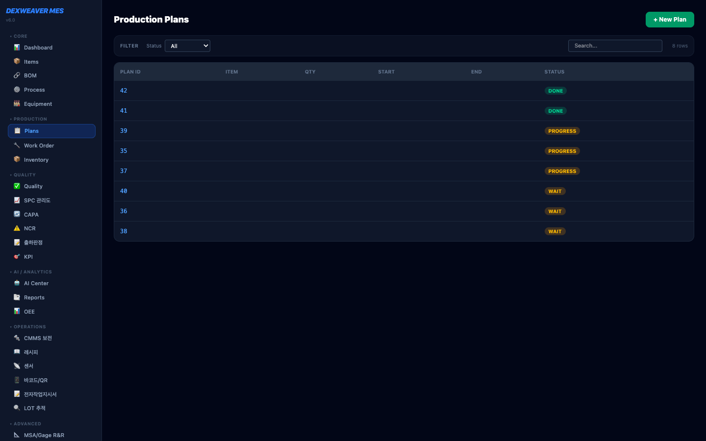

### Capture 17.  공정/라우팅 (`/process`)

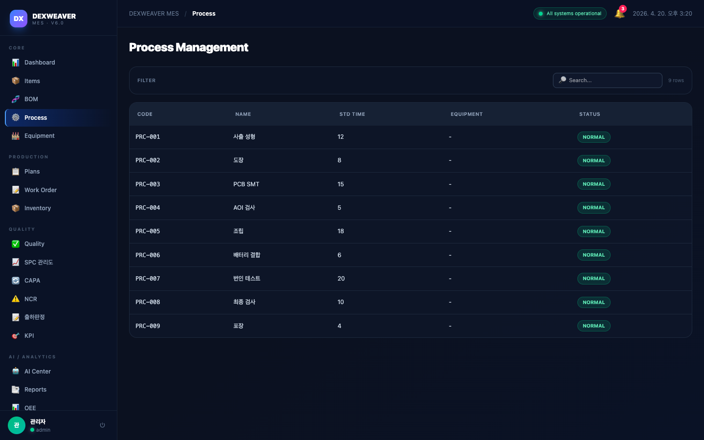

### Capture 18.  AI Center (`/ai-center`)

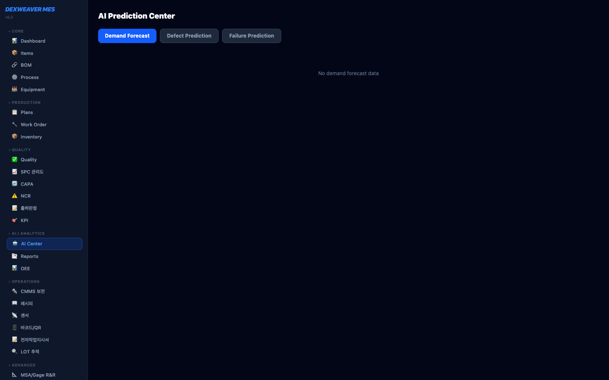

### Capture 19.  LOT Trace (`/lot-trace`)

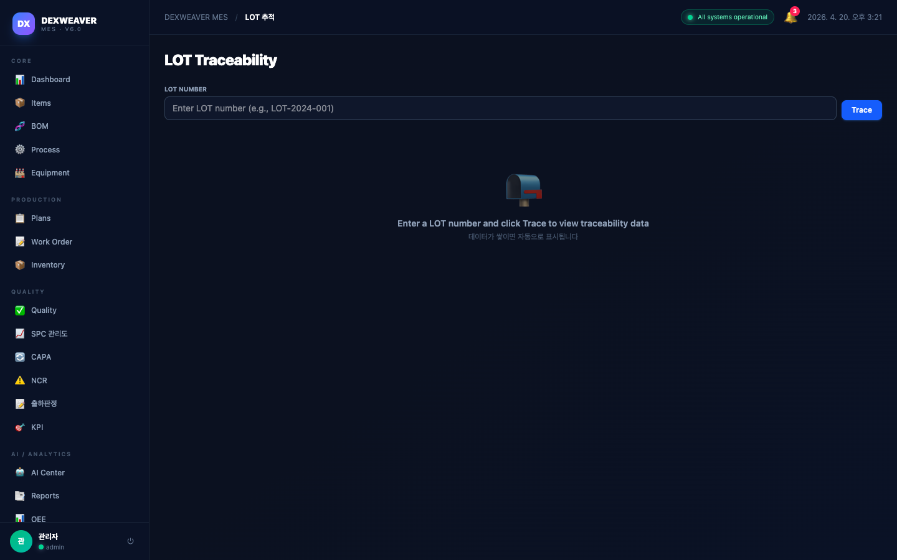

### Capture 20.  Reports (`/reports`)

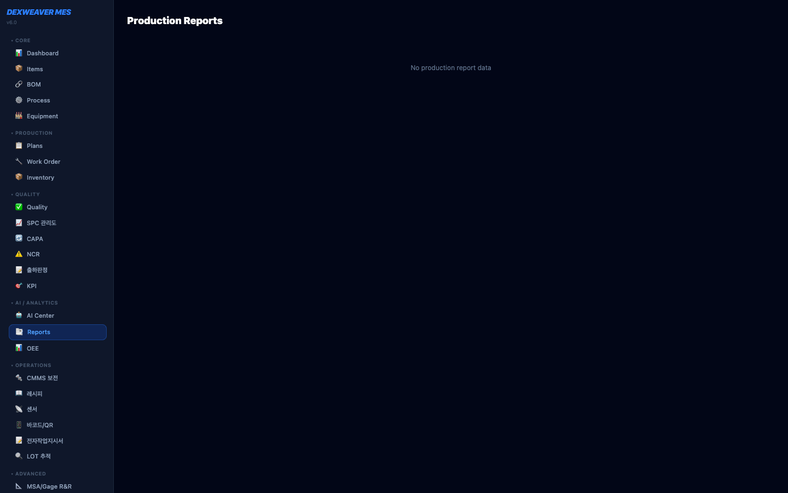

---

**작성일**: 2026년 4월 20일
**작성자**: 이양우 (인)
